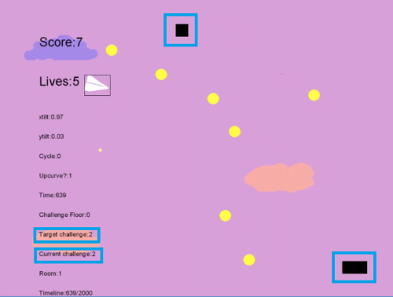
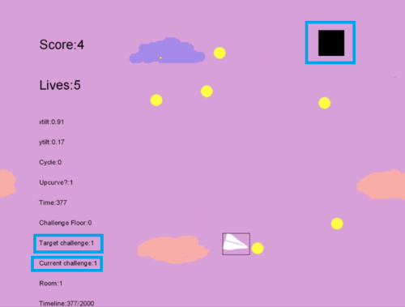
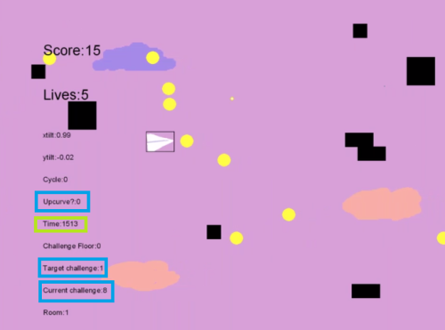
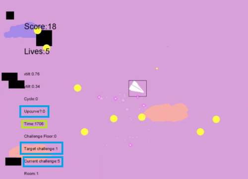

*Note: This post is originally from April 2017. I made a series of small games exploring interesting (to me) concepts, and am reproducing my old devlogs/doing retrospective writeups in 2020.*

*The game itself is available [on Google Play](https://play.google.com/store/apps/details?id=com.AMinorStudio.Flight_of_the_Paperwing&hl=en_US) for the curious*

---

Hi! This week I wanted to talk about my approach to the procedural generation of difficulty for the flying game I'm making for 1GAM.

Making a game in a month meant I didn't want to create levels and difficulty curves by hand. I also wanted the game to be potentially infinite, which necessitates some kind of procedural generation. It's been really good practice so far!

My approach:

Disclaimer: I have no idea if this is the “right” way to go about this, but it's working for me and I'm excited to share! I'll put side notes, asides and commentary like this in italics.

I decided to create a global Target Difficulty that gradually increases over time. (I'm still working on the exact rate of change. For prototyping I'm just using a linear increase, but I'm not sure I'm in love with how it feels.) Each obstacle is assigned a challenge value (as of this writing, the only obstacles are plain blocks, at a value of 1,  again for prototyping purposes). 

If the current game difficulty is less than the target difficulty, the game spawns obstacles at random until the target is reached. (I will probably allow the target to be slightly exceeded, once I have obstacles that are worth more than one point, but I will have to see if that affects gameplay much. It may be that I will have to ensure that targets only spawn to the exact target difficulty.)

Pretty straightforward: target challenge is 1. There is 1 object onscreen, with a challenge rating of 1.  Therefore, current challenge is 1 and no more objects will be spawned.

Each object is spawned a bit off screen, and travels from right to left. I found this created a much better sense of a pre-existing world than having obstacles pop in onscreen. On spawn, each object's challenge rating is added to the current global challenge value.

(I actually think that having obstacles spawn onscreen would also be a lot of fun, as long as the player is given ample warning time to react, but ultimately I liked the offscreen effect better for this particular game and effect.)

Once an obstacle leaves the screen on the right-hand side, it is destroyed, and its challenge level is subtracted from the current difficulty level.

Look, now the target challenge is 2, and there's 2 objects onscreen! Crazy how that works.

Now this is all fine well and good, but there needs to be ebb and flow. The player needs time to rest, collect some MacGuffins, and take a breath before the difficulty increases again.

So, there are a few more values that come into play. One of these us upcurve. It is so named because, while true, the game is curving upward in difficulty, and the target challenge will increase over time. Not very creative, but creativity in naming conventions makes for a huge mess. Ask me how I know.

At a certain number of steps into the game – for now 1500 because why not – I set upcurve to false. While upcurve is false, the target difficulty decreases rapidly over time. As objects move offscreen, no more are spawned for a little while. In this case 500 steps for prototyping.

Here you can see – upcurve is 0. Target challenge is 1. There are 8 items onscreen, and the current challenge is 8.

As objects move offscreen, no more are spawned, and the current challenge decreases. Obviously.

When those 500 breathing steps (about an eight-second break) are complete, upcurve is set back to true, and the game gets harder again.

But there's one more thing. Too many repetitions of this cycle will get super boring. There should be ebb and flow, sure, but the game should still get harder over time. There's a couple of ways to do this. I may end up making the rest periods shorter and the difficult stretches longer, for example. But for now I'm just making the difficulty peaks more difficult.

To accomplish this, I have the challenge floor value. The target challenge may never fall below the challenge floor. So the first time this cycle runs, the challenge floor is 0. Though it probably should be 1, come to think of it. 

The second time this cycle runs, when upcurve is set to false, the target difficulty will still rapidly decrease over time. There will still be a largely empty screen of breathing room and things to collect. But when upcurve is set back to true, the target difficulty will be 2 instead of 1. The next time the cycle repeats, it will be 3, and so on, increasing over time. Until it hits a cap, of course, otherwise the game will crash eventually.

I'm probably way over-explaining myself here. And there's a lot of tweaking left to do. But it's a pretty solid solution so far.

  
