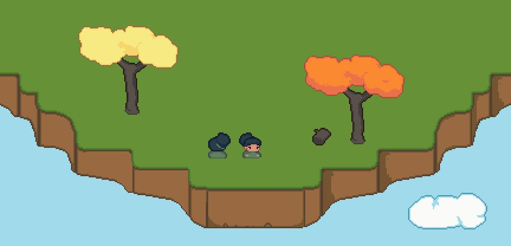

*Note: This post is originally from November 2017. I made a series of small games exploring interesting (to me) concepts, and am reproducing my old devlogs/doing retrospective writeups here.*

*This particular game turned out to be too ambitious for my project-management skills/code organization at the time, but I enjoy the concept, and think the AI code is also somewhat interesting. This post is about the concept.*

---

I'm working on a sort of crafting/farming sim. The kind that are oh-so-popular lately. But super tiny. And on an island in the sky, inhabited by one NPC. The intention isn't to make one of those big, sprawling masterpieces; it's to make something pretty and atmospheric, hopefully make an impressive mini show piece to direct people to, and learn a lot in the process. So I'm setting it up so that I can keep expanding it as I learn neat new stuff.

Basically I'm building a pretty, experimental sandbox for myself, and hopefully somebody else enjoys it.

The premise:

There is one NPC. She is an AI, and the player is essentially a friendly spirit, interacting with her small world. This is somewhat different from other games in the same/related genres.

For example, in games like Animal Crossing, Stardew Valley and Minecraft, there is a player character. You have an avatar voxel/sprite avatar in the world and directly interact with the world as that character, in first or third person.

In games like Dwarf Fortress and all its progeny, you're essentially a god of the machine, organizing schedules and issuing orders that the NPCs under your control carry out. The 'how' is sort of abstracted away. Are you the idealized representation of all the NPCs' planning abilities/conversations/free will? Are you an actual, present god issuing direct commands that they follow? Are you the Queen of this little ant colony/beehive, where the purpose isn't to model human behavior, but to model a hive mind?

In my game, I'm foregoing both of these options in favor of something a little bit more like From Dust. In that game, the player is a limited god/nature spirit/creator myth entity leading their people to safety/knowledge/sustainable settlements. You can create the path, but they decide how to follow.

Following from this premise, I took away the ability to issue direct commands and went with the From Dust mechanic because I want her to feel like she has a distinct personality and her own goals. Frankly, this is partly because I felt a little weird about making a game where you essentially have a captive woman in a static virtual dollhouse, and you issue orders to her that she immediately obeys. Somehow it's less weird with a whole colony of people and/or an urgent, definable goal.

In that vein, you have the ability to interact, in a limited way, with the world of this solitary NPC on her island. She does the actual building and the day-to-day business of living, but you can interact and improve things.

There's a couple of reasons I'm choosing this direction. One is that there's not really an endgame goal the way there is for many other games. So I don't want there to be a feeling of a 'lose' condition, either.

Another is that this is an ongoing project/toy box/workbench to teach myself things, to wrap my head around coding various mechanics, and to practice honing in on a consistent feel and style across a project with many assets.

And most of all, I really like the idea of opening up a window to a small world that ticks on cozily without you.