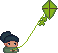

*Note: This post is about a game demo I originally made in November 2017. I made a series of small games exploring interesting (to me) concepts, and am reproducing my old devlogs/doing retrospective writeups here.*

*This particular game turned out to be too ambitious for my project-management skills/code organization at the time, but I enjoy the concept and design, and think the AI code is also somewhat interesting. This post is about building the AI.*

---

A few years ago, I wanted to build a completely atmospheric game that had shades of survival, farming and general sims. You can read about the concept [here](aminorstudio.com/posts/2020-07-20-ai-concepts), but the main thing was that I wanted to have an AI with an organic-feeling personality. I didn't want her to have a set schedule or routine, but instead to act upon her own whims and needs.

To accomplish this, I first set a timer within the game engine (Game Maker, but the language isn't as important as the concept here) that would fire off a function, changeState, that just returned a random number within a range every *x* steps. Then I created a simple state machine that represented several activies: Sleeping, eating, wandering and leisure. These each corresponded to a number, and the NPC would switch to whatever state matched the number returned by changeState. I then weighted these activities a bit to make sure that she wasn't constantly sleeping or eating, with the intention to later implement many other activities, like harvesting/watering plants, crafting, etc.

Just this simple state machine was a surprisingly good start, and resulted in a pleasantly organic cycling of actions. But it didn't quite feel autonomous, and she wouldsometimes switch among activites at ridiculous times. So I added more factors that would weight the transition chance in different directions.

For example, I added a needs counter to the NPC. Over time, her hunger and tiredness go up. The amount of hungry or tired she is weights the probability that she will sleep or eat, obviously. When a need is maxed out, she will override her next task and either sleep or eat as soon as she completes her current task. I chose to prioritize eating over sleeping to avoid conflicts when both needs are maxed out.

But I knew I wanted her to have a wide variety of activities to choose from, and wanted her to feel that she had a personality. So I also added a simple form of mood tracking. Each mood is an array of multipliers that affects aspects of every activity state. For example, if the state machine is in the happy state, she will move slightly faster, complete chores and have her needs filled slightly faster, and spend more time doing the leisure activities. (One of the first activities I had built in was kite flying, for some reason.) Leisure activities provide a positive bonus to mood, and having a high needs meter provides an increasing debuff to mood. I had plans to implement weather-based mood and other likes/dislikes as well, with the eventual goal of being able to randomly seed an NPC's personality for each player.

This mood system was partially inspired by the game [Rimworld](https://store.steampowered.com/app/294100/RimWorld/). I really admire the way that the developers were able to create an emotionally compelling narrative from randomly generated attributes.

Finally, I flagged some tasks as "uninterruptable" so that the NPC wouldn't, say, stop wandering aimlessly to go pick up the kite and then immediately drop it to go to sleep. I decided that an uninterruptable task is a task that fulfills a need, and cannot be interrupted until the need meter has been fulfilled at least a certain amount. So if the NPC is 100% hungry, she must eat until she is 70% hungry before harvesting a plant. That sort of thing.

The wander state serves as an intermediary 'default' state (again inspired by Rimworld, although in that game it seems like the wandering state indicates that the NPC needs a task), akin to a human puttering around. While wandering, the NPC picks a random point at a random distance from her, and then meanders towards that point, avoiding obstacles but not trying to calculate the most efficient path. I found that having a neutral, not-doing-much-of-anything state/task helped relax the gameplay a bit, slow the tempo, and add a lot of artificial organic feeling to the NPC's behavior. 

All of these factors came together to create an NPC that seemed pretty autonomous, and to have her own personality! I was pretty pleased. When I implemented all of this, I felt like it was probably a hacky and terrible way to achieve my goals, but was proud of the fact that it did, at least, achieve my goals. To be honest, I sort of assumed that it must be a bad solution since I had muddled through it on my own. But a few years later when I was starting to research basic AI, I ran across this [explanation of Markov chains](https://setosa.io/ev/markov-chains/) and suddenly felt pretty good about it!

When I have a little bit of spare time (hah), I plan to get the game back into a playable working state and deployed somewhere, so that this blog post is less of an abstraction. I probably will not be implementing any of the crafting elements, but at least having a demo of the NPC cycling through her various states would be nice.