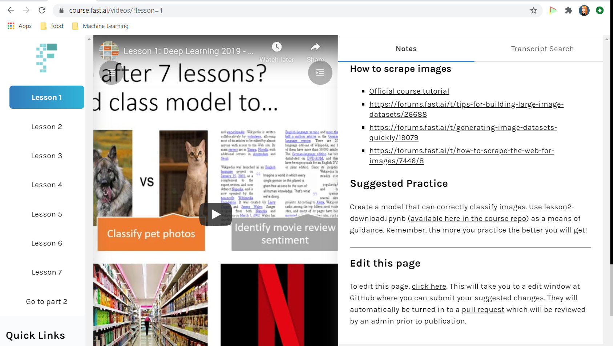
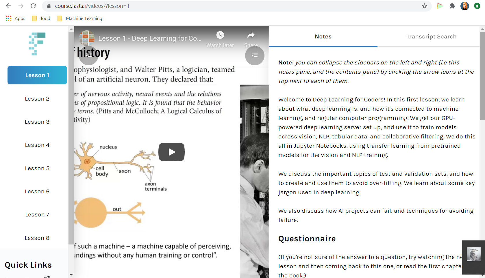

This is part of a series of articles covering [fast.ai's](https://www.fast.ai/) machine learning course. Part notes, part review, part process writeup, mostly for me, but also for anyone who's interested.

## Why am I doing this?

As a species, we're at the beginning of something really exciting. What happens next is up to us. The future will be shaped by our curiosity now. But it will also be shaped by how responsible, how judicious, how compassionate we are.

With that in mind, I (like many people, I know) am simultaneously excited and terrified about the direction we're going with AI. I feel that we have a tremendous responsibility right now to set things up so we don't create a nightmarish dystopia... and I want to have some small part in helping with that.

But aside from all of that grandiose and earnest navel gazing, I also want to play around with fun tools, make cool projects, and maybe teach a robot or two to love. After all, I'm a feral, self-taught dev; my whole deal is teaching myself stuff, and this seems like a pretty cool thing to learn.

**My background**
If you came across this article because you're reading up on fastai, it might help you to have some idea of my starting point. I'm a full-stack web developer who started taking programming seriously in November 2017. Before that I made a couple of small games, played with some LED strips and arduinos, and basically just messed around with no goal except to make pretty things happen. So I have about 3 solid years of programming experience, and have done a bit with Jupyter Notebooks specifically while messing around. I did briefly have a contract to help build out a ML-powered recommendation engine for a startup, but the anticipated funding did not come through, and the project was scrapped before we made much headway.

## The top-down approach

The first lesson and the site talk a lot about the top-down approach of building first, and addding in theory as necessary. I like this approach because that's how I bootstrapped my career. It was very scary when I first started (the sheer amount of nervousness I had around publishing my terrible code to Github back in the day makes me laugh now), and at first it feels sort of wrong to build things without understanding the underpinnings. I'd argue this is a good instinct, because cowboy coding and move-fast-and-break-things mentalities have contributed to HUGE problems in the world right now. It's a big reason that cyber-security, for example, is so terribly broken.

But for learning purposes, where you're not deploying to customers who depend on you, I think it's really great to build first, refine later. This makes me prefer the top-down approach as opposed to, say Andrew Ng's machine learning course, and is a big reason I picked fastai after reading reviews of both.

I think I may have a slightly unusual perspective on this in that I've come to think of it as a very natural process due to my music background; you study theory, sure, but most professional musicians start playing a decade or more before taking a theory class. I started late at 6/seriously at 11, but that was still well before I knew any theory. Practice is the main thing, and then the theory comes later. 

And as soon as I was able to separate code from the idea of a formal academic setting, it clicked into that practice-oriented part of my brain and everything became a lot easier. I suspect that people who have always had a theory first, apply later background may find the top-down approach more uncomfortable for longer.

**Note** I wrote the above after reading the course introduction, but before watching the intro video/reading the accompanying notes. It turns out they make the same point about musicians, referencing "A Mathematician's Lament." So, yeah, I definitely seem to have a background-specific advantage here with being suited to top-down learning!

## A weird note
I discovered Fastai on 8/16/2020, and went through the setup process and the first lesson. I was in the process of cleaning up my notes into a blog post and finishing up the exercises on 8/21/2020 when I refreshed the page and suddenly it was different. The course was completely (and silently, as far as I know) updated. It turned out I had it open in another window on another computer that I hadn't refreshed yet, and I was able to confirm with that and the Wayback Machine that no, I'm not insane, the page at course.fast.ai was different a few hours before, as was the first lesson.

So that was sort of frustrating, since I'd spent the past week grabbing a few hours here and there to get to the recommended 10 hours/week, and wrote a LOT of stuff about it, but at least it was only the first week, so it's not so bad to start over.

In the first video, they mention that this is supposed to be the definitive version, so that's overall a positive, and I like the new inclusion of study questions for each topic.

I am a little bit annoyed that I set up a GCP instance when the new version relies only on Colab, but that's life. I haven't decided whether I will keep using the instance or not. It does cost money, but I like having all the notebooks in one place and not having to save copies to my Drive/deal with the Colab presentation. I don't like that the official suggestion for navigating to notebooks is:

"Alternatively, head on to the Colab Welcome Page and click on 'Github'. In the 'Enter a GitHub URL or search by organization or user' line enter 'fastai/fastbook'. You will see all the courses notebooks listed there. Click on the one you are interested in using."

It's not a big deal in the grand scheme of things, and saving money is good.

The first video is pretty straightforward, explaining a lot of the concepts (weights/parameters, the general idea of a machine learning model) and showing a few of the possibilities. I didn't dive quite as deeply into the models and training for this notebook because I did a deep dive on the v3 lesson one, and already have a now-obsolete writeup of training a model on poison ivy vs lookalike classification.

But I enjoyed the video overall, and look forward to continuing the updated course this week.
