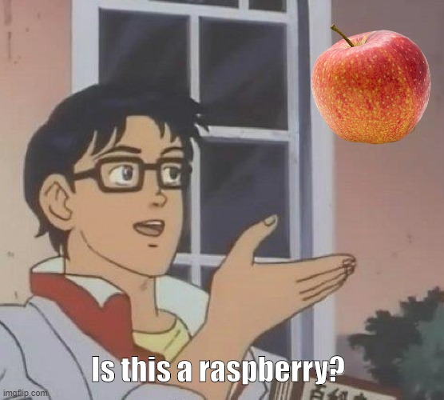
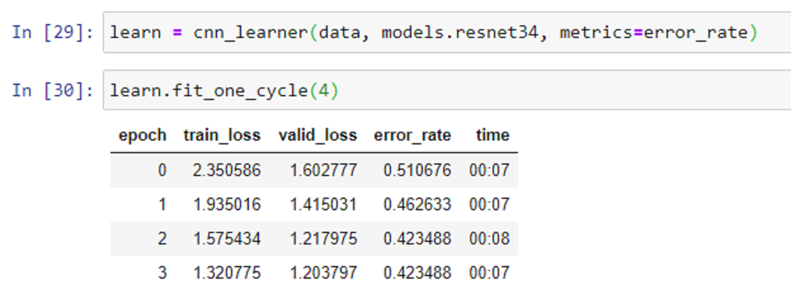

This is a series of articles covering [fast.ai's](https://www.fast.ai/) machine learning course. Part notes, part review, part process writeup, mostly for me, but others might find it helpful as well.

**Why am I doing this?**

I'm simultaneously excited and terrified about the direction we're going with AI. I feel that we have a tremendous responsibility right now to set things up to go well, and not create a nightmarish dystopia... and I want to have some small part in helping to do that.

At the same time, I am a feral, self-taught dev. I thrive on teaching myself concepts, and machine larning is a natural next step.

Right now I feel that machine learning, while it's a buzzword that gets thrown around a lot, 

**Tl;dr: **

**Sunday Night**
Set up the machine, watched through the video and took notes. It's an hour and forty-five minutes long.

I decided to use the [Google Cloud Platform instructions](https://course.fast.ai/start_gcp.html) because that's the platform with which I have the most experience. (I've set up a few Jupyterhubs/Kubernetes clusters for data scientists in my day, although it's been a while.)

I did already have the cli installed from previous GCP explorations, so I didn't go through the whole Ubuntu terminal process.

Pretty straightforward.

**Monday Night:**

After going through the first tutorial (the instructor recommended not trying to follow the video the first time, and going through twice, good advice that I did not follow), the suggested practice was to make a model that can identify pictures. As a transplant (har har) from the desert who has only ever had to worry about plants like cacti, which very pointedly (I'm on a roll) warn you not to touch them, I live in constant fear of poison ivy. I might be more afraid of it because I haven't run afoul of any so far, honestly. But regardless, I am very afraid of poison ivy.

So I decided to see if I could get a model to recognize poison ivy versus poison ivy lookalikes.

That gave me several label categories right away:

* Boston Ivy
* Virginia Creeper
* Aromatic/Fragrant Sumac
* Raspberry
* Bramble
* Hog Peanut/ Amphicarpa Bracteata

I didn't use all of the categories because raspberry, blackberry and strawberry were all just so common and I knew the pictures would be hugely polluted, so I just went with raspberry. I figured, why torture myself with 3? And box elder is a big old, distinctive tree, so... I mean, I guess the leaves look similar, but not so much of a concern there.

Right away, I learned that there's two types of poison ivy, Eastern and Western. Eastern is a vine, and climbs. Western isn't, and therefore doesn't. Also they have grayish-white berries?

But the good news is they both have three notched leaves. I don't know if it really matters to distinguish between the two, as presumably you'll know generally if you're in the east or the west, and may not care what kind of poision ivy you're dealing with.

With that decided I created my dataset. The tutorial has you go to google images and search scroll for as long as you want, then run this handy little command in the javascript terminal.

```
urls=Array.from(document.querySelectorAll('.rg_i')).map(el=> el.hasAttribute('data-src')?el.getAttribute('data-src'):el.getAttribute('data-iurl'));
window.open('data:text/csv;charset=utf-8,' + escape(urls.join('\n')));
```

It will find each element in the document with the class 'rg_i' (I guess whatever minification process Google uses generates that for the images). If that element has a data-src attribute, grab its url (data-iurl) and stick it in an array. Then it will open a file and add the (joined) url array on a newline character, effectively making rows.

Note: I hadn't actually seen the escape() javascript built-in function before. MDN says it's deprecated, but it works here.

***Adventures in clean dataset procurement***

When creating the datasets from Google images, the tutorial suggests looking at the photos a bit and deciding what, if any terms to exclude. For example, Virginia Creeper is a vine, but it is also a trail (pictures of people on bikes), a hornworm (pictures of bugs), and, for some reason, this delightful gentleman.


http://www.lepetitarchive.com/collections-raf-simons-aw-02-virginia-creeper/

Side note, this is a wild fashion collection, and I fully plan to go back and give in to my distraction impulses at a later date.

But I managed to wrench myself away from that rabbithole, add "-raf -simon" to my query, and soldier on.

I wasn't able to completely clean my queries. For example, one image of a robin with the tag "Virginia Creeper is for the birds" taunted me, as did this really weird and slightly NSFW album art. But I really didn't want to manually exclude every edge case from 700 images, so I decided to try practicing, and if the error rate was insane, then I would learn something.

This resolve was tested with aromatic sumac. The pictures for sumac are *wildly* varied. Like... I don't even know what to say.

For raspberry, I knew that was going to be a nightmare so I searched for:

"Raspberry bush leaves" -butterfly -table -document -map

Which did pretty well, actually! But there were still a few things like this:





Likewise, hog peanut is also an affectionate or brand name for various types of farming equipment and a bunch of other stuff. The scientific name fared a little better, but I'm worried for this one because getting specific enough not to have 8 million different colors and shapes of flowers also means there's a really limited number of images.

I'm actually really happy that I chose this classification challenge, though. I'm really pleased with the wide variety of quality in datasets for labels, and I'm curious to see what will happen.

If I needed a really good dataset I'd probably check out the (consult your notes from that one talk), because they have a lot of good resources. But I would have to spend time figuring out how to scrape their site in particular, and I really like having a dataset with a wide variance in quality because I'm learning.

***Tuesday Night***
Didn't have as much time, just uploaded the files and set the model to train before going to bed.

I tucked all the logic into a quick loop because I was too lazy to run the command a bunch of times. Side note, it didn't seem very important to put the urls into a .csv file, seeing as we were already printing them to the file separated by line breaks and all. So I didn't actually put the urls into a .csv, I put them into a "document" of unspecified extension and it worked fine.

So my code ended up looking a bit different from the notebook, more like:

```
# QoL function
def hyphenate(input):
    f = input.split(" ")
    return "-".join(f).lower()
    end

classes = ["Boston Ivy", "virginia creeper", "fragrant sumac", 
           "raspberry", "bramble", "amphicarpa bracteata"]

for c in classes:
    folder = hyphenate(c)
    path = Path('data/plants')
    dest = path/folder
    dest.mkdir(parents=True, exist_ok=True)
    download_images(dest/folder, dest, max_pics=200)

for c in classes:
    d = hyphenate(c)
    verify_images(path/d, delete=True, max_size=500)
```

And the rest was the same.


You love to see it.

*** Wednesday night ***
Literally started up my instance at 12:30 am. Healthy habits!

Fired up my cnn_learner (side note, I don't know why the video and the tutorial use different learners. I'll have to look into the differences betwen the 2018 and 2020 versions, maybe?) and showed it a bunch of plants.

Annnd...


You hate to see it.

I wasn't sure if the model needed more or fewer pictures, in lieu of better quality pictures. So the first thing I did was up the limit to 600.

Spoiler alert: this did not work.

I didn't really expect it to, because I would expect the images to get less relevant as we get further down the Google Image results.

But, uh.


Ouch.

Then, just for fun, I cranked it down to 100 pictures. I expected that to not make too much difference.



Looks like 200 is a well-selected sweet spot. So, definitely will need a better dataset.

To test my theory before I started going crazy with narrowing the image search, I removed the weakest classes from the list. These were fragrant sumac and amphicarpa bracteata (hog peanut). I accomplished this by the very smart and dignified method of moving the offending folders to another spot for a minute. Work smarter, not harder, right?


Ok, promising! Now we're getting somewhere.

Unfortunately by this point it was 1:45 am, so the tuning would have to wait until Thursday.


Sources:
[The Michigan Nature Guy's Blog](http://www.michigannatureguy.com/blog/2015/10/20/poison-ivy-lookalikes/)


gcloud compute ssh --zone=us-east1-b jupyter@fastai-instance -- -L 8080:localhost:8080