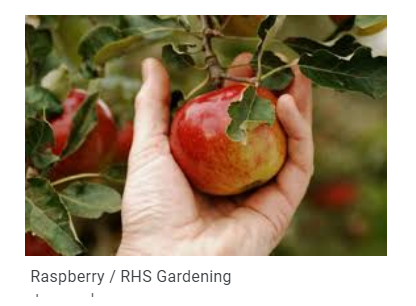
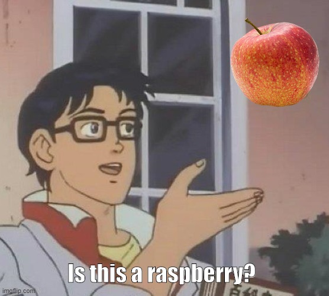
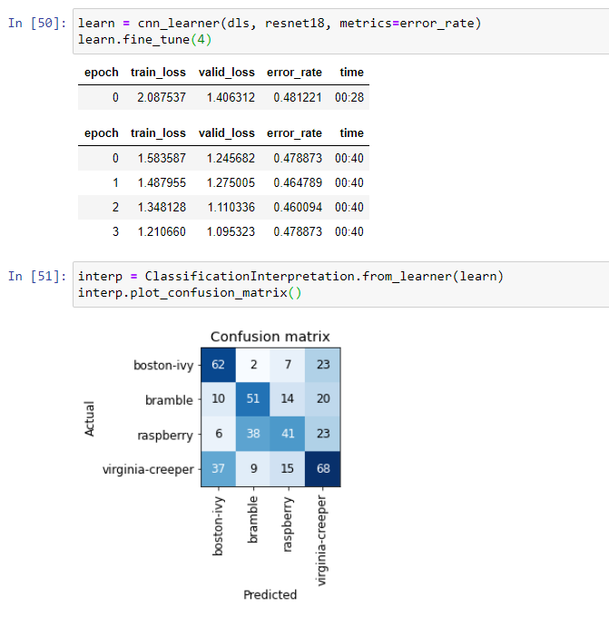
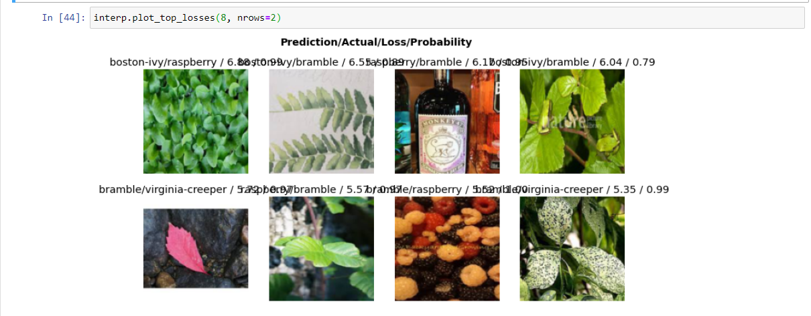
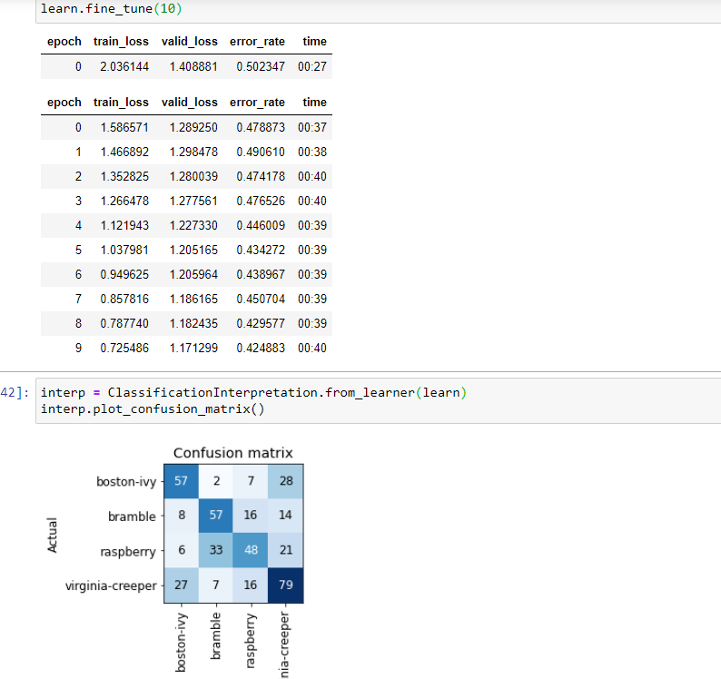
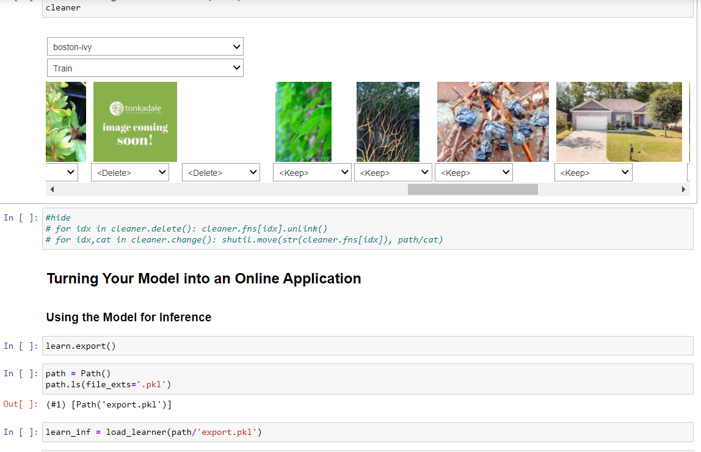
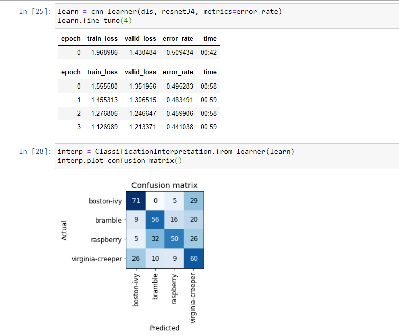
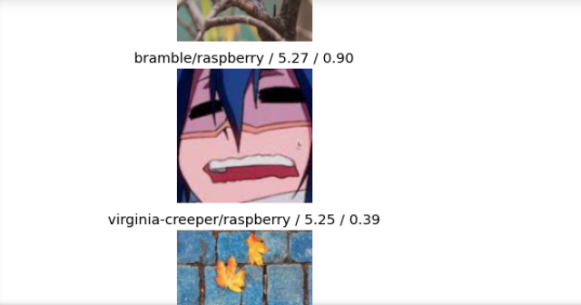
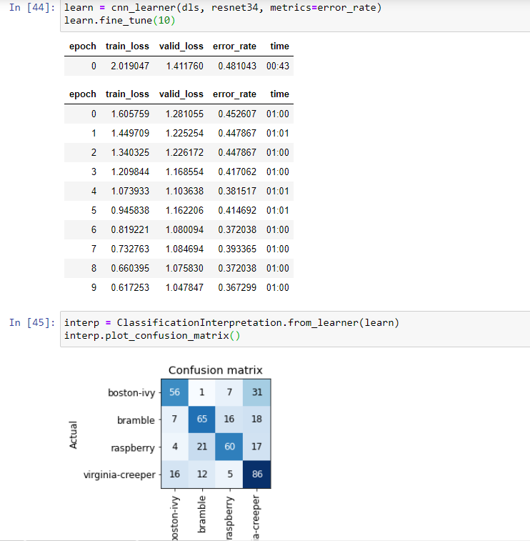
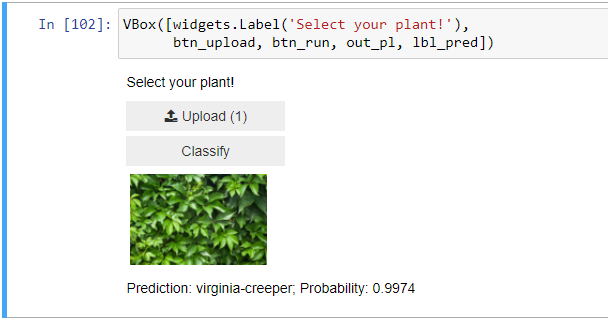

*This is part of a series of articles covering [fast.ai's](https://www.fast.ai/) machine learning course. Part notes, part review, part process writeup, mostly for me, but also for anyone who's interested.*

-----

Week 2's video was mostly about p-values and priors. I get the feeling that it may be review for a lot of people who are taking this course, but it was all new for me, and that part moved very quickly. So I'll need to add some stats learning in there as well. I've had my eye on [Think Stats](https://greenteapress.com/wp/think-stats-2e/) for... forever... aspirationally. Guess it's time to make good!

The other part of the post was training a model for image recognition; this post is a little bit of a rework, because I started the course right before the August 2020 v4 update, and completed the first lesson, which went through the same process. So I ended up reworking my existing work to fit the new format.

## Data

One of the study directives is to "create an image recognition model using data you curate, and deploy it on the web." I already had a curated dataset from Google images and decided to use that instead of doing the recommended Bing-based process.

I decided to see if I could get a model to recognize poison ivy versus poison ivy lookalikes.

I chose this partly because I live on the east coast right now, but I lived in the southwest for most of my life, and as a transplant (har har) from the desert who has only ever had to worry about plants like cacti, which very pointedly (I'm on a roll) warn you not to touch them, I live in constant fear of poison ivy.

And partly because I wanted to see what would happen when a model was trained on leaves that look really, really, really similar. To me, a lot of leaves look a lot closer to each other than bears or cats do to other bears or other cats. Is this true, or is it just what I've been more evolutionarily fine-tuned to see? Will the model have an easier time? What kind of confusion matrix will arise?

So, I looked up poison ivy and a few lookalikes.

[The Michigan Nature Guy's Blog](http://www.michigannatureguy.com/blog/2015/10/20/poison-ivy-lookalikes/) gave me several label categories right away:

* Boston Ivy
* Virginia Creeper
* Aromatic/Fragrant Sumac
* Raspberry
* Blackberry
* Strawberry
* Bramble
* Hog Peanut/ Amphicarpa Bracteata
* Box Elder

I didn't use all of the categories because raspberry, blackberry and strawberry were all just so common and I knew the pictures would be hugely polluted, so I just went with raspberry. I figured, why torture myself with 3? And box elder is a giant tree, so... I mean, I guess the leaves look similar, but not so much of a concern there.

Right away, I learned that there's two types of poison ivy, Eastern and Western. Eastern is a vine, and climbs. Western isn't, and therefore doesn't. Also they have grayish-white berries?

But the good news is they both have three-notched leaves. I don't know if it really matters to distinguish between the two, as presumably you'll know generally if you're in the east or the west, and may not care what kind of poision ivy you're dealing with. It's also worth noting that apparently western and eastern poison ivy can crossbreed, which to me means that they might be similar enough not to differentiate too much.

This may be a huge oversight in my process (and could contribute to the huge error rate you'll see below), but my goal here is to create a learning model and deploy it, not actually protect anyone from poison ivy, so I hope I can be forgiven for not adhering to the very highest standards.

With that decided, I created my dataset. The v3 version of the class had you scrape google images, but that involves going into the javascript console and running some commands, and I won't reproduce exactly how here because I'm not 100% sure that it's completely within the ToS. The new version of the course is worded in such a way that I am a little bit worried they discovered it was, and that's why they don't suggest it anymore. But I already have the data, and I'm not *sure* it's against the ToS/couldn't find it if it is, so...

When creating the datasets from Google images, the tutorial suggests looking at the photos a bit and deciding what, if any terms to exclude. For example, Virginia Creeper is a vine, but it is also a trail (pictures of people hiking/on bikes), a hornworm (pictures of bugs), and a fashion line featuring this delightful gentleman.

Side note, this collection is wild, and I fully plan to go back and give in to my distraction impulses at a later date.

But I managed to wrench myself away from that rabbithole, add "-raf -simon" to my query, and soldier on.

I wasn't able to completely clean my queries. For example, one image of a robin with the tag "Virginia Creeper is for the birds" taunted me, as did this really weird and slightly NSFW album art. But I really didn't want to try to manually exclude every edge case from 700 images, so I decided to try practicing, and if the error rate was insane, then I would learn something.

This resolve was tested with aromatic sumac. The pictures for sumac are *wildly* varied. Like... I don't even know what to say. Honestly, I just faltered and decided not to train it on sumac. My rationale is that perhaps further in the course, when I have a better idea of what's going on, I'll have a better head for how to curate datasets.

For raspberry, I knew that was going to be a nightmare so I searched for:

"Raspberry bush leaves" -butterfly -table -document -map

Which did pretty well, actually! But there were still a few things like this:

Likewise, hog peanut is also an affectionate or brand name for various types of farming equipment and a bunch of other stuff. The scientific name fared a little better, but I'm worried for this one because getting specific enough not to have 8 million different colors and shapes of flowers also means there's a really limited number of images. So I ended up omitting that category, too.

I'm actually really happy that I chose this classification challenge, though. I'm really pleased with the wide variety of quality in datasets for labels, and I'm curious to see what will happen.

If I needed a really good dataset I'd probably check out the (consult your notes from that one talk), because they have a lot of good resources. But I would have to spend time figuring out how to scrape their site in particular, and I really like having a dataset with a wide variance in quality because I'm learning.

My final categories are:

* Boston Ivy
* Virginia Creeper
* Raspberry
* Bramble

## Training

In contrast to v3, this lesson didn't use fit_one_cycle. Not sure why, just found it mildly interesting.

Anyway, I fired up my cnn_learner and showed it a bunch of plants. Fastai sort of hand-waves this part for now, but I think that's part of the top-down approach.

Annnd...

You hate to see it.

(For contrast, the normal expected error rate is like 0.01 - 0.08.)

The top confusion images:

I'd be confused, too.

So then I decided to try training it on 10 epochs. I feared that this might result in overfitting, but it actually did improve the error rate a bit. Still far from good, though.

Maybe some dataset cleaning will help?

Yeah, I'm gonna go ahead and delete these, and then run the whole thing again.

About the same as the 10-epoch run, which makes sense. I'm a little disappointed; I was hoping that pruning the dataset would result in bigger gains.

I decided to try one more thing before moving on so as not to lose the forest of learning to train and deploy a model for the trees of trying to optimize a very dirty dataset: I notice we're using a resnet 18. What about a 34? That's so many more layers!

I expected that this might result in large gains, as it seems to me that these leaves have smaller differences among them than cats or bears, and adding more granularity of layers might help. It is also possible that this would confuse the model further because of the inclusion of bad data.

Resnet 34 produced a slightly higher error rate again.

And this was in the 'highest confusion' bucket.

Sigh. Also, does this mean that before, the model was somehow *more* confident about this image than some of the images of plants that were in the top confusion list before? Because that image has always been there, lurking in the dataset...

Anyway, at this point I was thoroughly convinced it's a data issue and I was at serious risk of losing the point of the lesson. But I couldn't resist doing one last pass of deleting images and cleaning them up, and then re-running one final time, using resnet34 and 10 epochs.

And hey! Would you look at that! It's still nowhere near a useful program, but that is some huge leaps in accuracy!

Alright, I have a model that is, like, sorta good at classifying plants. Let's deploy and move on with our lives.

## Deployment

Deployment dips into lesson 3 a bit.

I was very pleased to find that running the predictor on a couple of images produced good results. This further confirms my hunch that a lot of the error rate is from the polluted dataset, and the model attempting to classify a house as a plant or what have you.

Setting up a gui in the notebook is surprisingly straightforward. There are a lot of helpful widgets that will create buttons and the like for you, so that's kind of fun.

---------------------------
**NOTE** 

It was at this point, when I was about to upload a single picture of poison ivy and ask my model to classify it for me, that I realized something incredible. Something that, if you're reading this, you probably already noticed. Something that I cannot believe I overlooked.

I actually somehow forgot to include actual poison ivy in the training. Supposedly the entire point of the exercise. That is amazing.

Rather than go back and redo this entire process to correct that, I decided to resign myself to my shame and just have a model that is good at telling virginia creeper from raspberries. I am going to blame this on the fact that I am currently working full time as well as well as taking a couple of classes at a university, and subsequently am often working on machine learning pretty late at night. But rest assured, there was a lot of face palming.

----------------------------

*Anyway*.

Not bad, not bad! (I scrolled allll the way to the bottom of Google images for this one to find an image that the model hasn't seen before.)

Turns out there's a whole thing called voila that does most of the processing for you, and renders the jupyter notebook as an app, with the widgets. So that's cool.

I haven't chosen to deploy my model on Binder, but I have every intention of doing so in the future, once I get a better model going. For now I think I've learned and practiced what I need to for this lesson, and will continue with the rest of lesson 3 next week!