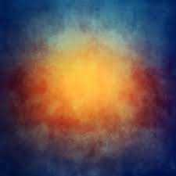
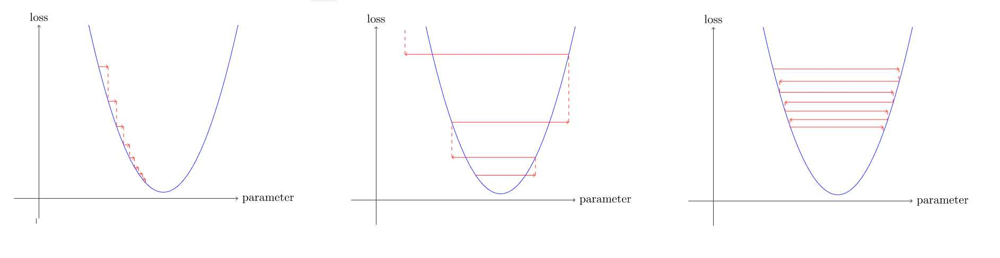

*This is part of a series of articles covering [fast.ai's](https://www.fast.ai/) machine learning course. Part notes, part review, part process writeup, mostly for me, but also for anyone who's interested.*

-----

I was hoping to do part 2 of lesson 3 last week instead of splitting it up, but I got very busy.

Side note, I've changed the title scheme slightly; I've been referring to "robots" for humorous effect, as in "teaching robots to love," but it's probably not the most accurate nomenclature and so I'm going to switch to ML and model and the like. But I'm not going to stop amusing myself with the titles.

## I'm Not a Mathematician, and I Don't Play One On TV
In this second half, we start getting into the math. Now, the story goes that when I was 6, I insisted I didn't need to learn to add because I'd never use it. And I have to admit that I do ruefully remember my parents telling me that I have no idea what will happen in my life so I shouldn't neglect math. I shrugged it off, and lo and behold, here we are.

I also don't know that I'm going to be making this my career, so I suppose I could skip this part and just run pre-built models forever to look at the pretty outputs.

But that's never really been enough for me. As much as anyone can be aware of their own strengths and weaknesses, one of my strengths and weaknesses is wanting to understand the bare-metal concepts, even if I don't use them on the day to day. This has cost me a fair amount of time and effort, but the payoff is that I seem to have a pretty good grasp on a lot of programming concepts compared to people with resumes of similar length, even if they might be better at making React components or the like.

Plus I do like math, I just classified myself as a liberal arts person really early, and had all the cis-lady conditioning as well as all the liberal-arts-person conditioning.

All this to say, if you have a math background, bear with me. If you don't, learn with me.

Anyway, enough about me, let's do some math(s)!

## Have You Worked Out What We're Looking For? ...Correct. The answer is Calcium. I mean Maths.
This lesson uses a simplified version of [MNIST 5](http://yann.lecun.com/exdb/mnist/), with just 3s and 7s. If you have some ML background, you've probably heard of MNIST. (I, uh, hadn't.)

NumPy and Tensorflow both have a handy array() function to get the data out of an image. If you've gone through the exercise of writing image filters before, this part will be familiar.

So we grab a bit of that array and colorize it with pandas. I'm not that familiar with DataFrames yet, although I have worked with them a bit doing random stuff. The colorization is a cool feature!

And then we pause the video to try to work through how we'd train a model to recognize 3 vs 7 to make a baseline that is simple to implement and will perform with a fair amount of accuracy.

## Thought Experiment
My first thought is to give the model some basic rules. I know we can't cover every edge case, but (for example) was the bear-training model told that bears generally have four feet?

If that is true, then we can assemble basic characteriscs.

A 3 has:

Curves
A 7 has:

Straight or diagonal lines
I was going to write something about how the 3 has two parts of equal width stacked on each other, but actually I wonder if just curves and straight/diagonal lines would be enough. Some 7s may be written curvier than others, or with a line through the stem, sure, but I'd posit that the curve of a 3 is almost always going to look very different than the corner of a 7.

This seems like a decent approach, but I don't know how I would actually implement it. I would be relying on a model already trained on images or something to do a lot of hand waving.

## Thought Experiment, take 2
So, for something I can maybe pseudo-code, my second thought is to show it a bunch of 3s and ask it to remember the locations of the pixels it saw. If I were to manually code this, it would go something like:

    pseudocode
    for set in data_set
        for x of set 
            composite[x] = 255 if y[x] > 0 else composite[x] = 0

This should produce a composite number with no anti-aliasing, just black and white.

Then when classifying an image, I would check the input image against the aggregate image, and if there are too many misses, I would say this is not a match overall. I'm not sure exactly what percentage of misses would disqualify an image; that would definitely take some fine tuning. But that would be how I would approach this problem using the hammer I already have.

## Video's First Approach
Conceptually I wasn't too far off, turns out! In the video, we average the values of the pixels to create an "ideal 3" and "ideal 7" as a baseline. (A baseline is a simple model that you're pretty confident about, that is easy to implement.)

I theorize that the average will be better because it allows for more forgiveness and variation in the idea of an ideal number. It might also be easier/more elegant to implement.

I am also reminded of Trevor Paglan's Goldfish, which has been in the back of my mind since I saw it in 2018.

Still in love with those colors

So we assemble our set with a list composite, a concept I unfortunately just ran across for the first time during a code challenge on the 11th, and open them as tensors.

    t_of_threes = [tensor(Image.open(o)) for o in threes]

I'm not personally a fan of the 'three_tensors'/'seven_tensors' variable naming in the video, as my brain keeps wanting to parse it as "three tensors" rather than "tensors made up of images of 3s". I don't know if t_of_threes makes more sense generally, but it does to me.

To get the average, we use 
    
    stack(t_of_threes).float()/255.

This stacks all the images on top of eachother in a cube, and averages the columns. It also creates a tensor from the list, which is better for doing computations. Then we convert the ints to floats for precision in averaging, and divide by 255 to normalize (between 0 and 1) because the max value for a color value is 255.

A tensor can have many axes/dimensions. The list of these axes/dimensions is its shape. The length of its shape is its rank.

This seems a bit jargony to me, but it's also emphasized as important jargon.

In this case, we want to take the mean of axes[0], which is the stack of images. The other two axes are x and y.

Importantly, we can't just keep track of the differences between an image and the ideal image. Some results will be positive and some will be negative, which can cancel out and look like there is no difference. If I understand correctly, this won't be a problem for all images, but will be for enough of them that we have to address this.

So we have to measure the mean absolute difference/L1 norm or the root mean squared error/L2 norm.

These sound like instant eye-glazers, but L1 norm means to just take the absolute value (remove the "minus" sign), and L2 norm means to square the differences, take the mean of that, and then unsquare it by taking the square root. Not too thorny.

To put it visually, as in the book:

    L1 norm/ mean absolute difference:

    dist_3_abs = (a_3 - mean3).abs().mean()

    L2 norm/ root mean squared error

    dist_3_sqr = ((a_3 - mean3)**2).mean().sqrt()
There's also a built-in function, l1_loss or mse_loss, that does the L1 norm/L2norm for you.

Immediately, just the fact that there's a built-in mean function makes this method way easier to implement than my plan to return 0 or 255. The video further explains that broadcasting virtually eliminates loops. Converting everything to tensors, stacking, and then taking the mean of the stacked axis is MUCH simpler to implement than my looping version, as well as much faster. (I admit I don't know why, preciesly, as of right now.)

## Broadcasting
So what happens when you have two tensors with different ranks?

Broadcasting automatically expands the smaller-ranked tensor to match the larger one by pretending to make copies, to simulate an elementwise operation.

(Elementwise operations are how tensor[1,2,3] + tensor[4,5,6] = tensor[5,6,7])

So if you have a single image that has no stack, it will only have an x and y axis, or height and width. In this case, broadcasting will pretend that it is a stack of images equal in size to the 3-rank tensor, and compare the single image against everything in the stack.

For the final outcome, we just ask if the distance between the image and the ideal 3 is greater than the distance between the image and the ideal 7, and return 3 or 7 accordingly. I can imagine that this would be much more complicated when dealing with numbers that are more similar to each other, or are more often written in more different ways. But for now this code can predict a 3 or a 7 with over 90% accuracy, and that's pretty cool!

At the end of all this stacking and broadcasting and averaging, we haven't really built a full model, though. As the video points out, we aren't testing against fitness and iterating to improve. And if the machine doesn't learn, how can we call it machine learning?

## Stochastic Gradient Descent

The steps (here copied from the book verbatim)
>
>Initialize the weights.
>For each image, use these weights to predict whether it appears to be a 3 or a 7.
>Based on these predictions, calculate how good the model is (its loss).
>Calculate the gradient, which measures for each weight, how changing that weight would change the loss
>Step (that is, change) all the weights based on that calculation.
>Go back to the step 2, and repeat the process.

Iterate until you decide to stop the training process (for instance, because the model is good enough or you don't want to wait any longer).
The rest of the course is about diving into these concepts.

Thankfully, the computer will do a lot of the calculus for us. And also a lot of the remembering. Like using the requires_grad function to keep track of the calculations. And then you can use backward to take the derivative.

Definitely will need to be reading up on derivatives this week; I know that the the gradient is the slope, and the derivative is the slope at a point, but will definitely be looking to grok that a bit more fully.

This diagram was really helpful for displaying the learning rate calculation. Too low and the steps take too long and become unusable. Too high, and there's errors.

If for some reason you're reading this while doing the lesson, I would highly recommend walking through the examples and looking at the graphs. There's a cool example about roller coasters and how their speed changes over time. The lesson ends a little bit abruptly, but it's a two-hour lesson in which we talked about ethics and built a simple machine learning model that just needs a loss function now, so I'm glad they didn't keep going even further.

We're definitely reaching the edge of my wheelhouse now, and I'm here for it.

 

------------------------
***Further Reading***

[Stochastic Gradient Descent — Clearly Explained !!](https://towardsdatascience.com/stochastic-gradient-descent-clearly-explained-53d239905d31)

[A quick introduction to derivatives for machine learning people](https://towardsdatascience.com/a-quick-introduction-to-derivatives-for-machine-learning-people-3cd913c5cf33)