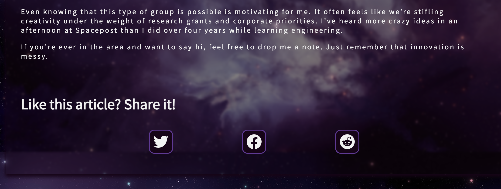

You may or may not have come across the idea of [Responsible Share Links](https://jonsuh.com/blog/social-share-links/). 
From the article:

> "Social share scripts are convenient and easy to copy & paste but rely on JavaScript and add additional overhead to your site, which 
> means more HTTP requests and slower load times. Instead, use share links that don’t require you to load scripts for each social site."

Sounds good to me! I'm a big fan of implementing simple components myself anyway, rather than loading a million libraries. So I wrote a quick React component to add share links to the upcoming website overhaul of Spacepost.io.

```
  const [popup, setPopup] = useState({
    url: ""
  })

  function windowPopup(e) {
    let screenSize = getWindowDimensions();
    var width = screenSize.width/2;
    var height = screenSize.height/2;
      e.preventDefault();
      console.log(e.currentTarget.getAttribute('href'))
      var url = e.currentTarget.getAttribute('href')
      setPopup(url)
    
      var left = (screenSize.width / 2) - (width / 2),
        top = (screenSize.height / 2) - (height / 2);  
      window.open(
        url,
        "",
        "menubar=no,toolbar=no,resizable=yes,scrollbars=yes,width=" + width + ",height=" + height + ",top=" + top + ",left=" + left
      );
  }

  function getWindowDimensions() {
    const { innerWidth: width, innerHeight: height } = window;
    return {
      width,
      height
    };
  }

```


Just bind to the click event of your link, and you're good to go. To construct the share URL from the page, I used the classic window workaround and passed that as props to my ShareLink component. I will also be adding the excerpt and possibly some other information as needed.

```
if (typeof window !== `undefined`) {
    shareURL = window.location.href;
  }
```

The workaround is because during [build](https://www.gatsbyjs.com/docs/conceptual/overview-of-the-gatsby-build-process/#build-time-vs-runtime), broswer APIs like window aren't available. This will throw an error when trying to build/deploy, unless you account for that.


<div style="height: 50px"> </div>
Pretty straightforward! There's probably a bunch of slick optimizations I can do, but this fits my needs quite nicely.
<div style="height: 50px"> </div>


<div style="padding-bottom: 2rem"></div>
