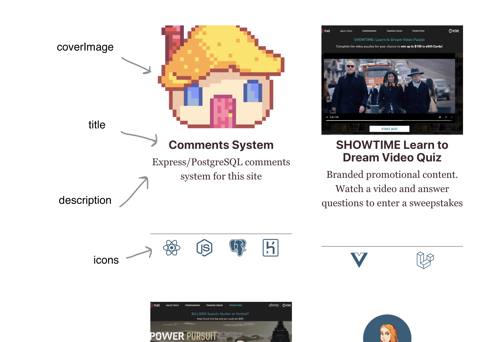

Project cards seem to be pretty in right now. Like many developers, I display my projects as a series of rectangles with a picture, a title, and an excerpt. I've chosen to add a little informational icon tray at the bottom with things like a link to the repo, and what tech I used.

The projects themselves are markdown files (as are my blog posts). This is maybe one of my favorite features of Gatsby, to be honest. I like writing markdown way better than spinning up a whole CMS. YMMV, of course, but this works great for me.

## Design

My project schema looks like this:

    ---
    posttype: project
    title: Comments System
    slug: /express-comments
    description: Express/PostgreSQL comments system for this site
    coverImage: ../../images/logo.png
    icons:
        - { icon: "react", link: "https://reactjs.org/", tooltip: "Built with React" }
        - { icon: "node", link: "https://nodejs.org/en/", tooltip: "Built with Node" }
        - { icon: "postgres", link: "https://www.postgresql.org/", tooltip: "Built with PostgreSQL" }
        - { icon: "heroku", link: "https://www.heroku.com", tooltip: "Backend deployed on Heroku" }
    visible: true
    date: 2021-03-24
    tags: [javascript, react, design, programming, full-stack]
    ---
    Project text goes here etc etc

When building from markdown, your schema can really be any kind of data that you want. I chose to add things like tags, icons, and a 'visible' boolean attribute so that I can draft posts before publishing them. The cards render from this data.  The project post itself will contain the rest of the text below the lines.

The data gets rendered like this:

I went for a really simple, clean design, but I've seen some great implementations that do all sorts of fancy hover effects and the like.

I chose to use both icons and tags so that I could tag projects with things like "design," "tutorial," "fullstack" etc, reserving the icon tray for technology and repo/deployment links. There is a little bit of redundancy between the tags and the icons, though.

## Project Pages
To make the project pages, I followed the steps in [Adding Pages to Markdown Files](https://www.gatsbyjs.com/docs/how-to/routing/adding-markdown-pages/). It's a good walkthrough.

## Project Card Components
I don't use a CSS framework on this site, because it's my portfolio, so I built my cards from scratch.

I queried the whole schema from graphql, resulting in a query that looks like:

    export const pageQuery = graphql`
    query {
        allMdx(filter: {fileAbsolutePath: {regex: "/(projects)/"  }}, sort: { order: DESC, fields: [frontmatter___date] }) {
        edges {
            node {
            id
            excerpt(pruneLength: 250)
            frontmatter {
                title
                visible
                description
                tags
                icons {
                icon
                link
                tooltip
                }
                coverImage {
                childImageSharp {
                    fluid {
                    ...GatsbyImageSharpFluid
                    }
                }
                }
            }
            fields {
                slug
            }
            }
        }
        }
    }
    `
Note: You can manually check what to query for by going to localhost:your-port/___graphql at any time while gatsby develop is running.

The card itself is a couple of pretty straightforward, standard patterns. The page query slots into the Projets page like:
    const Projects = data
      .filter(edge => !!edge.node.frontmatter.visible) 
      .map(edge =>  
        

            {edge.node.frontmatter.coverImage.childImageSharp && }
         <Link to={content.fields.slug}>
            <h2>{edge.node.content.frontmatter.title}</h2>
            
{edge.node.frontmatter.description}

        </Link>
        <IconTray icons={edge.node.frontmatter.icons} />
        

    return (
        
{Projects}

    )

This is a little simplified; I added some CSS Transition components for animation, for example, and the project page itself has more to it.

## The Icon Tray
My favorite part is probably the icon tray. It's just a little bit different than the standard image/title cards I see everywhere. For this, I made an IconTray component that looks like:

    const IconTray = ({ icons }) => 

        const Iconset = icons.map(icon => 
                    

                    <a aria-label={icon.tooltip} href={icon.link} alt={icon.tooltip}> {IconList[icon.icon]} </a>
                    
{icon.tooltip}

                    
)
        return (
        

            {Iconset}
        

    )
    }

Then I created an iconList that maps SVG icon components to aliases and then parses the corresponding object from the query.

All together, I ended up with nice project cards that link to explanatory pages, as well as external links to code, deployments, etc.

