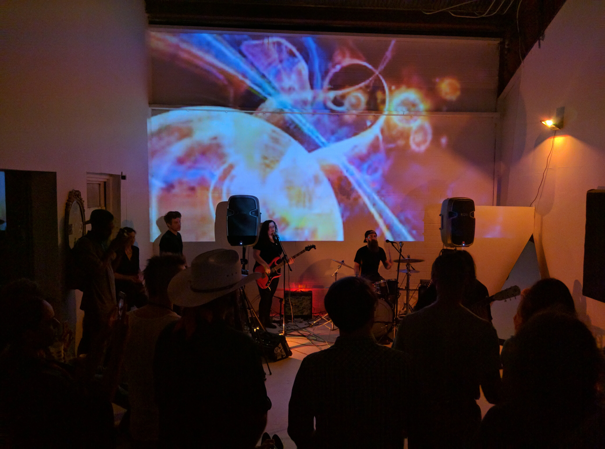

---
# SCHEMA:
#   - project:
#      title:
#      image:
#      description:
#      icons:
#        - iconset:
#            icon:
#            link:
#            tooltip:
posttype: project
title: Landing Page Series
slug: /landing-pages
description: Ongoing series of over 10 landing pages in Craft CMS
coverImage: ../../images/logo.png
icons:
    - { icon: "php", link: "", tooltip: "Built with laravel" }
visible: False
date: 2020-08-20
tags: [laravel, html, css, javascript, php,]
---
DRAFT
As part of Renegade Communication's marketing efforts, I build landing pages.

| | 
|:-------------------------:|:-------------------------:|
|| <iframe width="360" src="https://www.youtube.com/embed/xyhxyOsqBH0" frameborder="0" allow="accelerometer; autoplay; clipboard-write; encrypted-media; gyroscope; picture-in-picture" allowfullscreen></iframe> | |
|   |  
| |