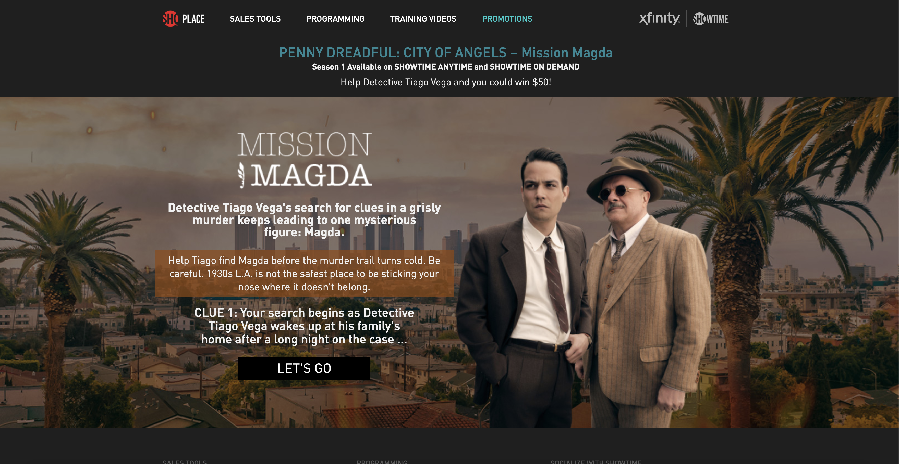

---
# SCHEMA:
#   - project:
#      title:
#      image:
#      description:
#      icons:
#        - iconset:
#            icon:
#            link:
#            tooltip:
posttype: project
title: Showtime Games
slug: /showtime-games
description: Branded scavenger-hunt games for Showtime's Billions and Penny Dreadful
coverImage: ../../images/billions-cover.png
icons:
    - { icon: "laravel", link: "laravel.org", tooltip: "Built with laravel" }
visible: True
date: 2020-07-20
tags: [laravel, html, css, javascript, php,]
---

This project was two branded sweepstakes games in association with Showtime, Comcast Xfinity, and other clients. The games are full-stack Laravel apps with Blade templating, where a user clicks on the appropriate location on the map according to provided hints in order to enter a sweepstakes. The user data is collected in a MySql database. A correct location is rewarded with a gif from the show and the next piece of the story; an incorrect guess elicits increasingly clear but snarky hints.

I have grouped these two games together because they are essentially the same game, but there were a few interesting differences in ending presentation and logic, such as one game having an extra reward screen and the other having two endings.

These Showtime activities feature:

- An emphasis on user engagement
- Data collection for sweepstakes

And were built with: 
- PHP and Laravel
- jQuery
- Bootstrap
- MySQL

  
  
 
 
 
 
 
 
 
 
