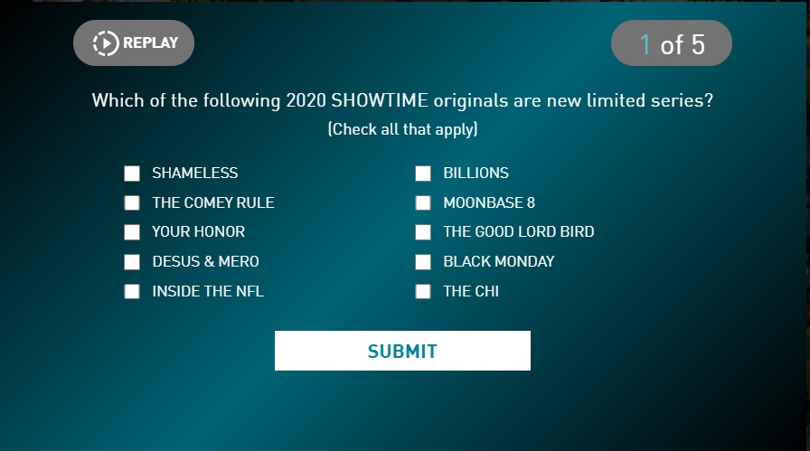
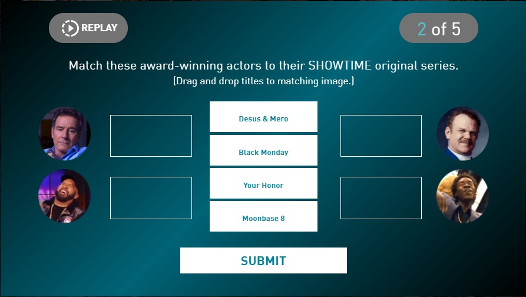

---
# SCHEMA:
#   - project:
#      title:
#      image:
#      description:
#      icons:
#        - iconset:
#            icon:
#            link:
#            tooltip:
posttype: project
title: SHOWTIME Learn to Dream Video Quiz
slug: /showtime-learn-to-dream-quiz
description: Branded promotional content. Watch a video and answer questions to enter a sweepstakes
coverImage: ../../images/project-images/showtime-quiz/showtime-quiz-video.jpg
icons:
    - { icon: "vue", link: "vue.org", tooltip: "Built with Vue" }
    - { icon: "laravel", link: "laravel.org", tooltip: "Built with laravel" }
visible: True
date: 2020-12-08
tags: [laravel, html, css, javascript, php, vue, mySQL ]
---

As part of Showtime's "Learn to Dream" campaign, I built a gamified activity designed to test users' knowledge of Showtime properties after watching a short video. Users can rewatch the video at any time in a popup modal, and must get at least 3 answers correct for the chance to be entered into a sweepstakes for a $25 eGift card. A perfect 5/5 allows entry into a sweepstakes for a $100 eGift card.

This video quiz features:

- Gamified elements
- Multiple-choice, single-answer and drag-and-drop question types for variety
- Interstitial feedback based on correct/incorrect answer
- Multiple endings based on score
    - Score < 3, get prompted to play again
    - Score 3-4, access entry to $25 sweepstakes
    - Score 5/5, access entry to $100 sweepstakes
- Entry form hooked up to a mySQL database
- Logos, form and sweepstakes rules customized per client (Xfinity, Comcast, and others )

And was built with: 
- Vue
- Laravel

| | 
|:-------------------------:|:-------------------------:|
| | 
| |   

     
