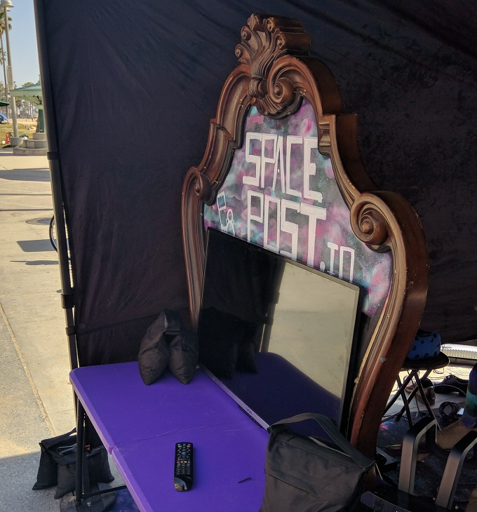
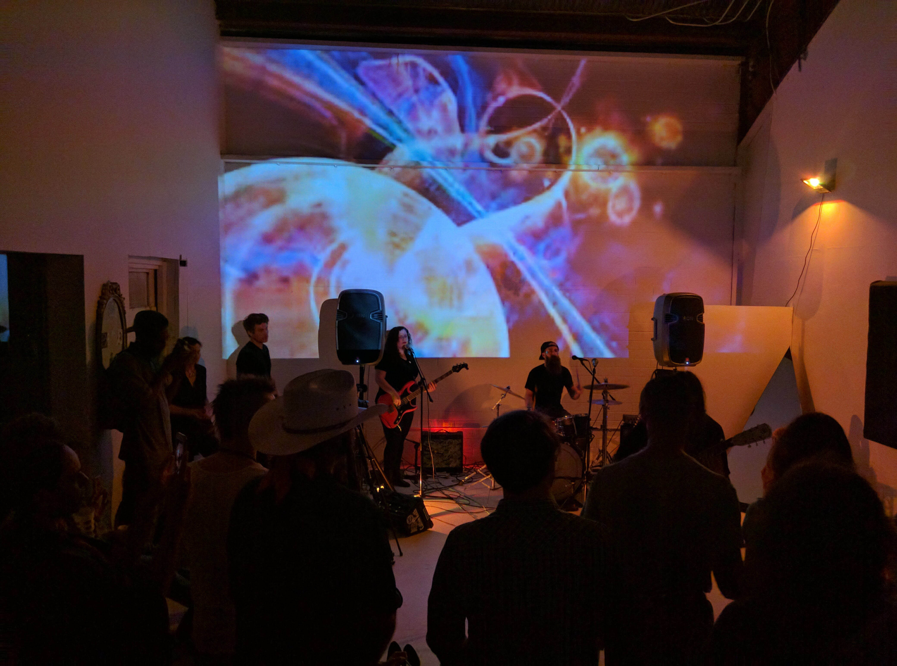
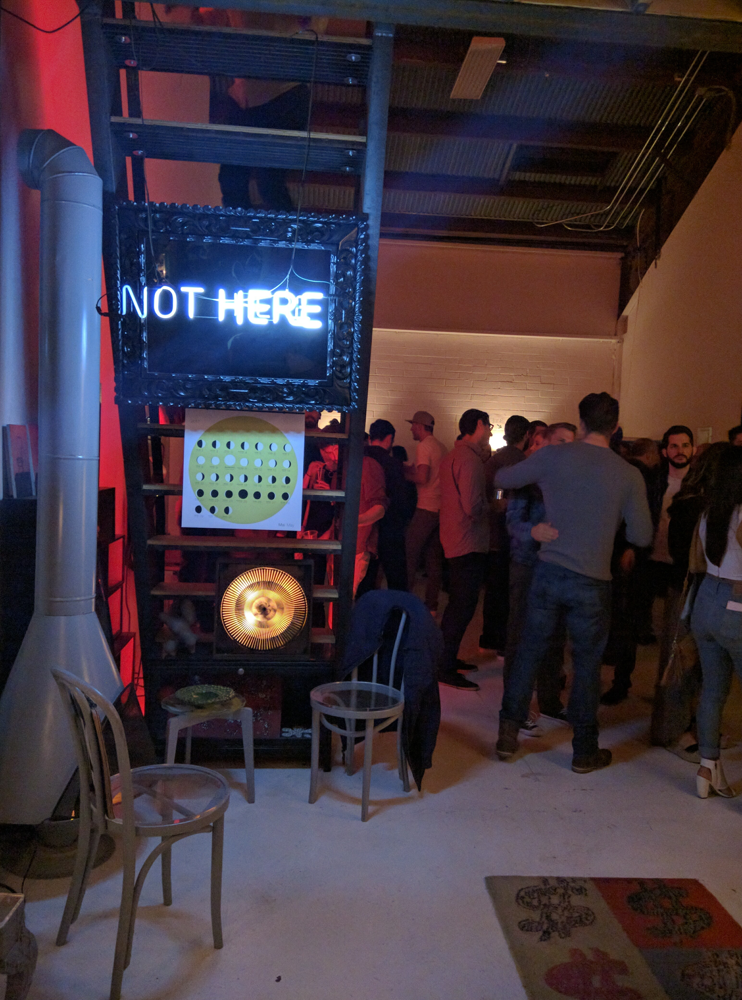
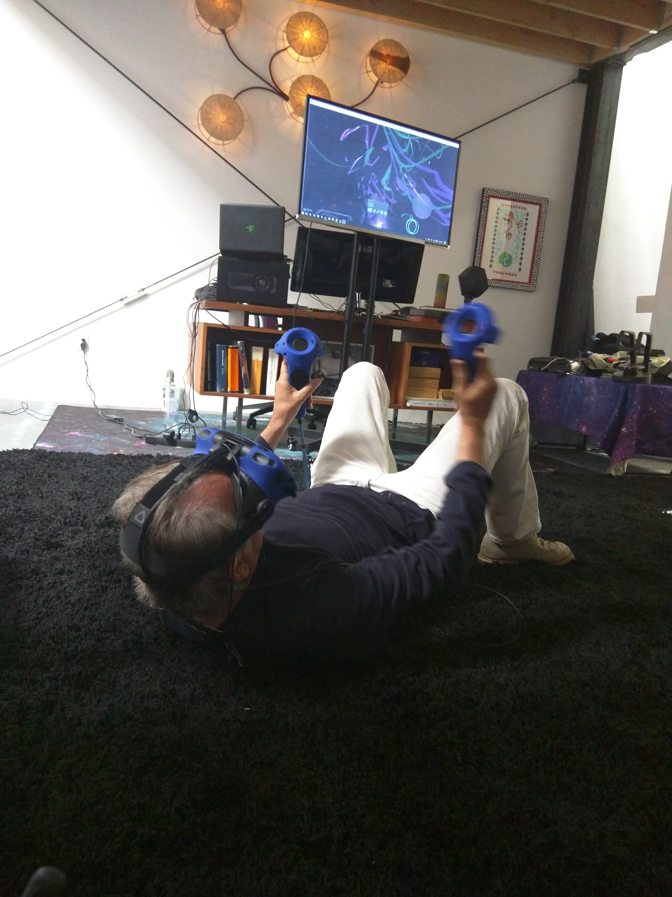

---
# SCHEMA:
#   - project:
#      title:
#      image:
#      description:
#      coverImage
#      icons:
#        - {icon, link, tooltip}
#      visible: bool
#      date: Consider removing this...
#      tags: []
posttype: project
title: Spacepost
slug: /spacepost
description: Co-founded an art/tech collective housed in the WNDO space in Venice Beach
coverImage: ../../images/project-images/spacepost/spacepost-2.jpg
icons:
    - { icon: github, link: https://github.com/PersonofNote/wp-react-demo, tooltip: "See the code on Github" }
visible: True
date: 2017-05-05
tags: [ art, technology, venice beach, spacepost, cofounder, hackerspace]
---
    
In 2017 I co-founded Spacepost, an art/tech collective and hackerspace, with Stanley Bishop. We started off doing virtual reality in an easy-up on the Venice Beach boardwalk before moving into the WNDO space, owned by longtime resident and artist Jim Budman. 

Through 2018 I developed branding, did web development and assisted in hobby data science projects, and helped build out the space and run locally-focused events, including:

- The ideation meeting for [Queens of the Stoned Age](https://www.imdb.com/title/tt7160388/)
- Episode premiere parties for [Queens of the Stoned Age](https://www.imdb.com/title/tt7160388/)
- Local music video premieres
- A mixed-reality art exhibit as part of the 2018 [Venice Art Crawl](http://www.veniceartcrawl.com/)
- [Matterport](https://matterport.com/) 3D-imaging of various spaces and art collections

I remain involved in the space in an unofficial capacity. Mostly notably, in 2019 I assisted in giving a talk about data visualization in Python using Jupyter notebooks, and in 2020-21 I am working on an overhaul of spacepost.io

The space continues to be a thriving space for STE(A)M advocacy and support, as well as holding events to support the local Venice Beach community.

| | 
|:-------------------------:|:-------------------------:|
| <iframe width="360" src="https://www.youtube.com/embed/d8e9zKZXAGY" frameborder="0" allow="accelerometer; autoplay; clipboard-write; encrypted-media; gyroscope; picture-in-picture" allowfullscreen></iframe>| <iframe width="360" src="https://www.youtube.com/embed/xyhxyOsqBH0" frameborder="0" allow="accelerometer; autoplay; clipboard-write; encrypted-media; gyroscope; picture-in-picture" allowfullscreen></iframe> | |
|   |  
| |

     