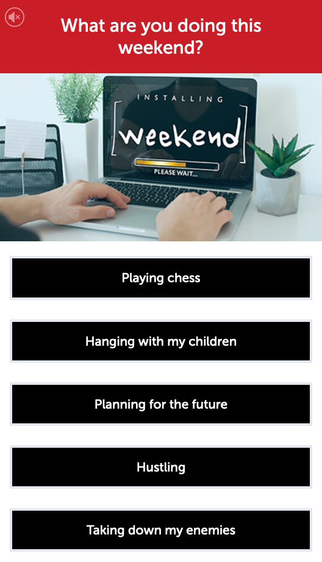
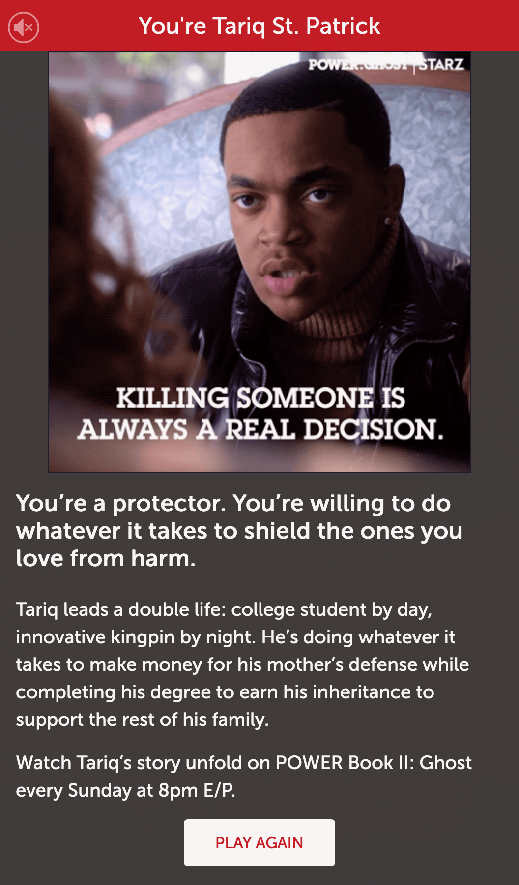

---
# SCHEMA:
#   - project:
#      title:
#      image:
#      description:
#      icons:
#        - iconset:
#            icon:
#            link:
#            tooltip:
posttype: project
title: STARZ Personality Quizzes
slug: /starz-personality-quizzes
description: Which Power Book or American Gods character are you?
coverImage: ../../images/project-images/starz-quiz/quiz-start.jpg
icons:
    - { icon: "nuxt", link: "https://nuxtjs.org/", tooltip: "Built with Nuxtjs" }
visible: True
date: 2020-11-28
tags: [laravel, html, css, javascript, php, nuxt, vue ]
---

STARZ wanted to drive engagement and consumer awareness for the shows Power Book II: Ghost and American Gods (upcoming). To that end, I built a fun personality quiz, where users answer questions to determine a personality match with a character from the show.

These Starz activities feature:

- An emphasis on user engagement

And were built with: 
- Vue (Nuxt)

| | 
|:-------------------------:|:-------------------------:|
| | 

     
